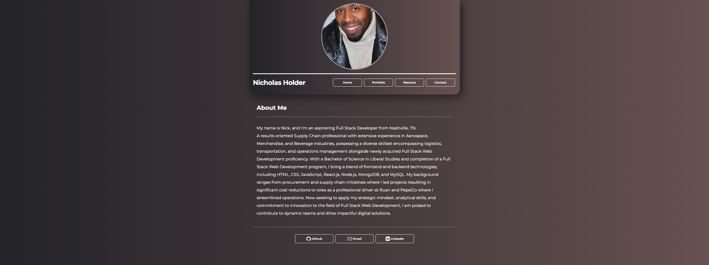

  # React Portfolio

  

  ## Description
  

 This is my personal portfolio website built in React! Here you can read about me, see my portfolio of work, download my resume, and coming soon is the ability to contact me via email!
 You can visit my site [here](https://andrue-desmarais.netlify.app/)

  ## Table of Contents
  - [License](#license)
  - [Questions](#questions)

 ## License
 [MIT](https://opensource.org/licenses/MIT)

  ## Questions
  If you have any questions, contact me on [Github](https://github.com/AndrueGage/) or email me at trainer.andrue@gmail.com
